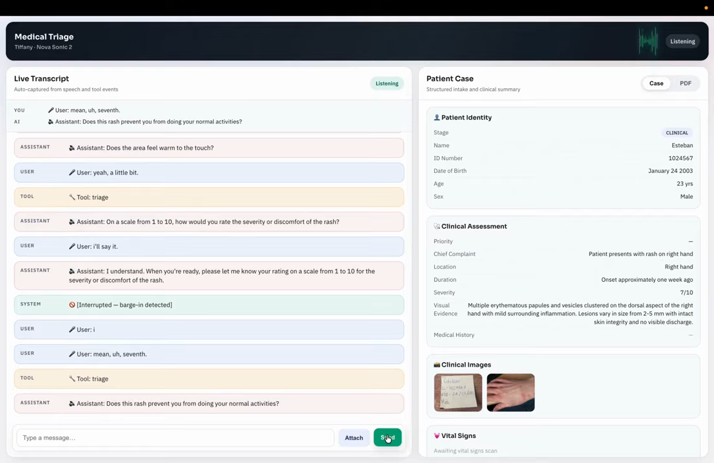
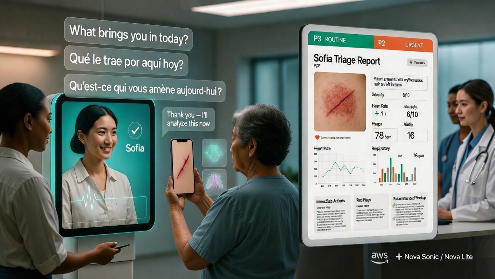
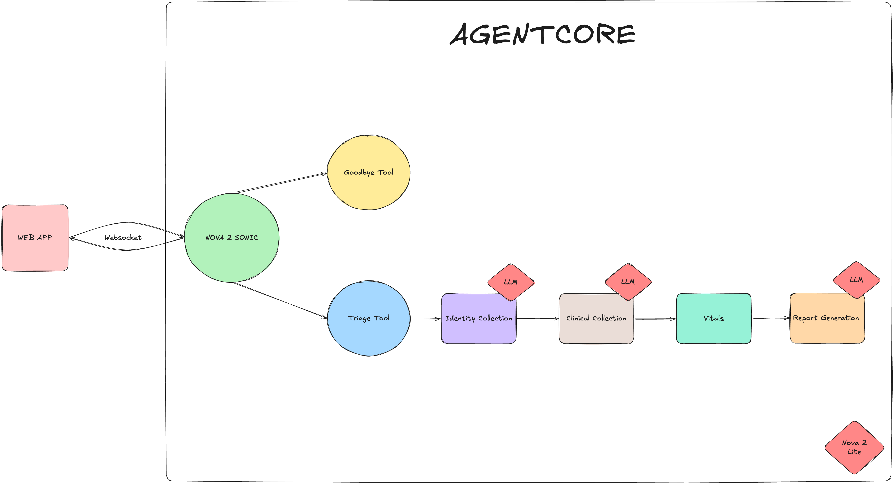
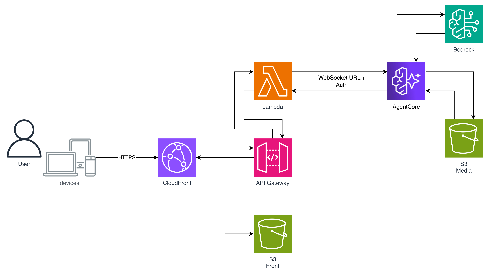

# SOFIA: Voice-First AI Triage Assistant

SOFIA is a voice-first medical triage assistant built for an AWS Hackathon. It helps clinics collect patient identity and clinical intake data through natural conversation before the doctor visit.

## Demo

[](https://youtu.be/EgiWo3aAqNE)

Link: https://youtu.be/EgiWo3aAqNE

## Project Visuals

### Cover



### Agent Pipeline



### Architecture



### Example Final Report

Sample agent-generated report: [Document.pdf](files/Document.pdf)

---

## Quick Start (AWS Deployment)

### 1. Set AWS environment

```bash
export AWS_PROFILE=<your-aws-profile>
export ACCOUNT_ID=<your-aws-account-id>
```

### 2. Deploy (Terraform + AgentCore)

```bash
chmod +x deployment/scripts/*.sh

./deployment/scripts/deploy.sh
```

### 3. Update frontend only (optional)

```bash
./deployment/scripts/deploy_frontend_only.sh
```

### 4. Cleanup

```bash
./deployment/scripts/destroy.sh
```